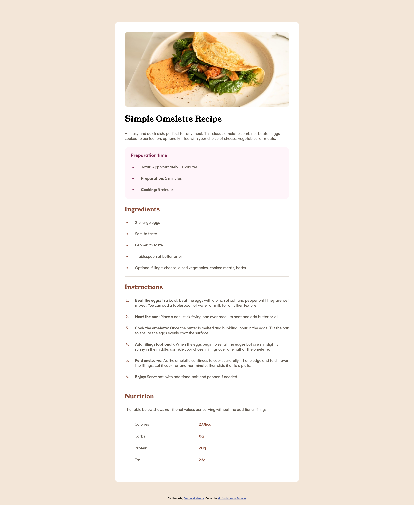

# Frontend Mentor - Recipe page solution

This is a solution to the [Recipe page challenge on Frontend Mentor](https://www.frontendmentor.io/challenges/recipe-page-KiTsR8QQKm). Frontend Mentor challenges help you improve your coding skills by building realistic projects. 

## Table of contents

- [Overview](#overview)
  - [The challenge](#the-challenge)
  - [Screenshot](#screenshot)
  - [Links](#links)
- [My process](#my-process)
  - [Built with](#built-with)
  - [What I learned](#what-i-learned)
- [Author](#author)
- [Acknowledgments](#acknowledgments)

## Overview

### Screenshot

### Links

- Live Site URL: [Recipe page](https://matiasmonzonrubano1-beep.github.io/Recipe-Page/)

## My process

### Built with

- Semantic HTML5 markup
- CSS custom properties
- Flexbox
- CSS Grid
- Mobile-first workflow

### What I learned

I learned how to properly style components using css and how to properly use html semantic tags.

## Author

- Frontend Mentor - [@matiasmonzonrubano1-beep](https://www.frontendmentor.io/profile/matiasmonzonrubano1-beep)

## Acknowledgments

I'd like to thank the user [lilianaad7](https://www.frontendmentor.io/profile/lilianaad7) for her feedback on my previous solution, where she pointed out how the way I was aproaching styles was not only inefficent but also overly complex. After reading her solution I figured out how to properly manage styles and semantic tags in a more ordered manner